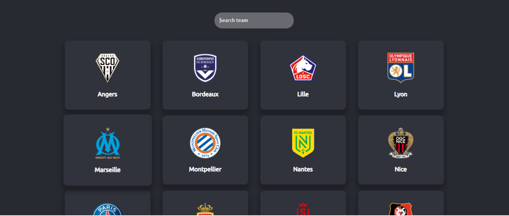
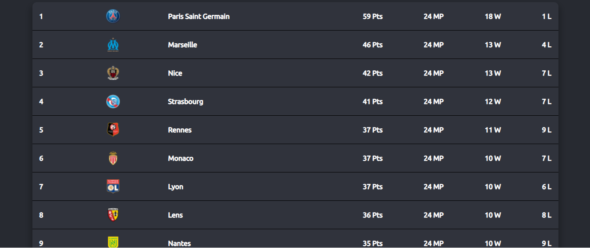
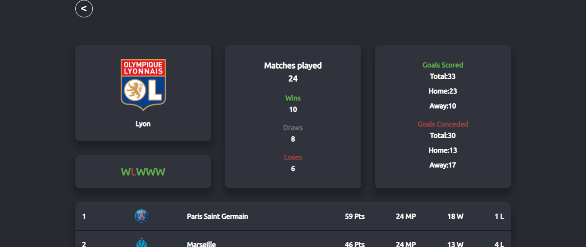
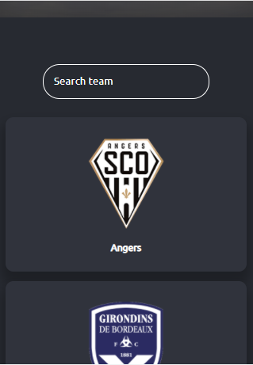

# Football-Stats

> This is a web app that displays current stats of the French league(Ligue 1) teams.

## Built With

- ReactJS

## Technologies used

- Redux
- React Router
- Sass
- React Testing Library

## Video Presentation

[Video Presentation Link]()

## Live Demo

> Warning! The API has limit of 100 requests per day!

[Live Demo Link (Netlify)]()
[Live Demo Link (Heroku)]()

## Getting Started

To get a local copy up and running follow these simple example steps.

### Prerequisites

To run the project on your local machine you need to have:

- bash cli.
- npm.

### Setup

Go to the terminal and type:

- `git clone https://github.com/anuarshaidenov/premstats.git [YOUR_PROJECT_NAME]`
- `cd [YOUR_PROJECT_NAME]`
- `npm install`

### Usage

To start a local server on port 3000 run:

- `npm start`

## Author

👤 **Victor Chukwuemeka**

- GitHub: [@chukwuemeka1234](https://github.com/chukwuemeka1234)
- Twitter: [@avc_victor](https://twitter.com/@avc_victor)
- LinkedIn: [ani-chukwuemeka](https://www.linkedin.com/in/vic-chukwuemeka/)

## Acknowledgements

Design inpired by [Nelson Sakwa](<https://www.behance.net/gallery/31579789/Ballhead-App-(Free-PSDs)>)

## 🤝 Contributing

Contributions, issues, and feature requests are welcome!

Feel free to check the [issues page](../../issues/).

## Show your support

Give a ⭐️ if you like this project!

## 📝 License

This project is [MIT](./MIT.md) licensed.